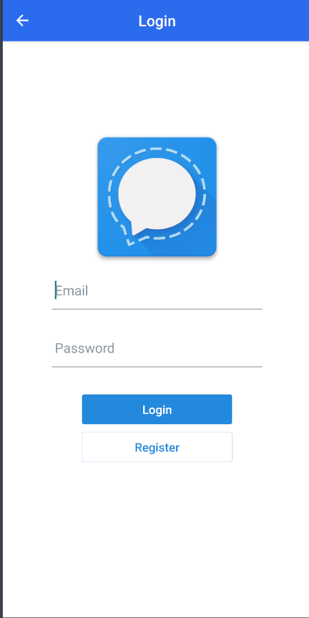
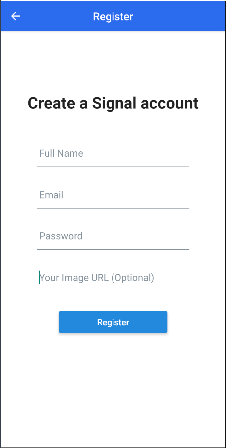
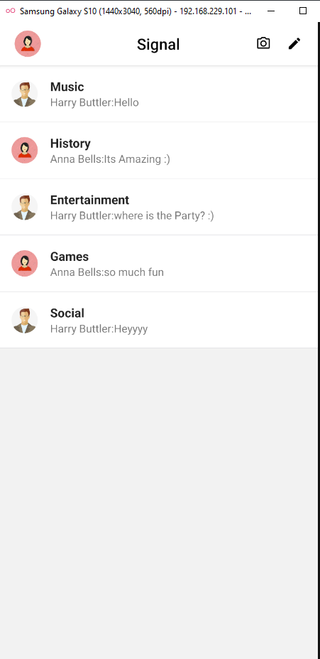
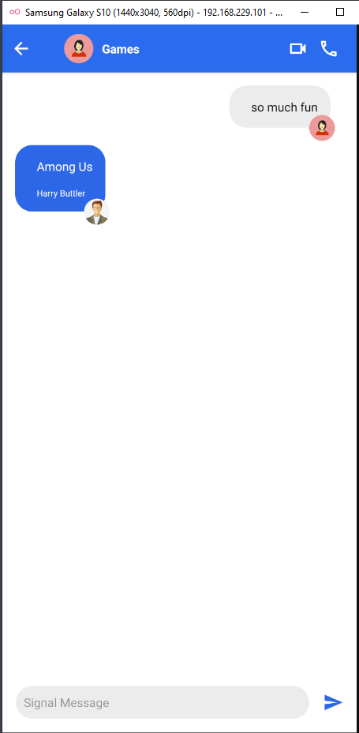

<h1 align="center">Signal-Clone-Project</h1>

## Overview







### Built With

- [React-native](https://reactnative.dev/)


## Features

This app comprises use of Stack Navigation and RESTFUL Web APIs

- User must first register on the register page. 
- After registration, the user can communicate by creating new chat channels.
- Have fun!!!


## How To Use

To use this application, the packages should be installed prior to running the app. From your command line:

```
yarn add @react-navigation/native

yarn add react-native-reanimated react-native-gesture-handler react-native-screens react-native-safe-area-context @react-native-community/masked-view

yarn add@react-navigation/stack

yarn add @react-native-firebase/app

yarn add @react-native-firebase/auth

yarn add @react-native-firebase/firestore

yarn add react-native-vector-icons

yarn add react-native-elements

```
